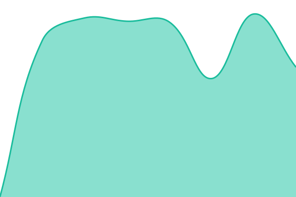
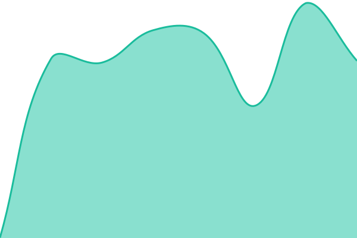

# [📈 Live Status](https://uptime.kimustory.net): <!--live status--> **🟧 Partial outage**

This repository contains the open-source uptime monitor and status page for [키뮤스토리](https://kimustory.net), powered by [Upptime](https://github.com/upptime/upptime).

With [Upptime](https://upptime.js.org), you can get your own unlimited and free uptime monitor and status page, powered entirely by a GitHub repository. We use [Issues](https://github.com/KimuSoft/uptime/issues) as incident reports, [Actions](https://github.com/KimuSoft/uptime/actions) as uptime monitors, and [Pages](https://uptime.kimustory.net) for the status page.

<!--start: status pages-->
<!-- This summary is generated by Upptime (https://github.com/upptime/upptime) -->
<!-- Do not edit this manually, your changes will be overwritten -->
<!-- prettier-ignore -->
| URL | Status | History | Response Time | Uptime |
| --- | ------ | ------- | ------------- | ------ |
|  [Kimustory](https://kimustory.net) | 🟥 Down | [kimustory.yml](https://github.com/KimuSoft/uptime/commits/HEAD/history/kimustory.yml) | 

 878ms
     
 | 

<a href="https://uptime.kimustory.net/history/kimustory">93.98%</a>
    

|  [Muvel](https://muvel.app) | 🟥 Down | [muvel.yml](https://github.com/KimuSoft/uptime/commits/HEAD/history/muvel.yml) | 

 2076ms
     
 | 

<a href="https://uptime.kimustory.net/history/muvel">98.92%</a>
    

|  [Dictionary](https://dict.kimustory.net/) | 🟩 Up | [dictionary.yml](https://github.com/KimuSoft/uptime/commits/HEAD/history/dictionary.yml) | 

 3612ms
     
 | 

<a href="https://uptime.kimustory.net/history/dictionary">94.14%</a>
    

|  [Archhive](https://archhive.kimustory.net/) | 🟥 Down | [archhive.yml](https://github.com/KimuSoft/uptime/commits/HEAD/history/archhive.yml) | 

 574ms
     
 | 

<a href="https://uptime.kimustory.net/history/archhive">53.13%</a>
    

|  [Sound Gallery](https://music.kimustory.net/) | 🟥 Down | [sound-gallery.yml](https://github.com/KimuSoft/uptime/commits/HEAD/history/sound-gallery.yml) | 

 630ms
     
 | 

<a href="https://uptime.kimustory.net/history/sound-gallery">0.00%</a>
    

|  [Yp Bot](https://yp.kimustory.net/) | 🟥 Down | [yp-bot.yml](https://github.com/KimuSoft/uptime/commits/HEAD/history/yp-bot.yml) | 

 1099ms
     
 | 

<a href="https://uptime.kimustory.net/history/yp-bot">94.28%</a>
    

|  [Ep Bot](https://ep.kimustory.net/) | 🟩 Up | [ep-bot.yml](https://github.com/KimuSoft/uptime/commits/HEAD/history/ep-bot.yml) | 

 572ms
     
 | 

<a href="https://uptime.kimustory.net/history/ep-bot">94.62%</a>
    

<!--end: status pages-->

[**Visit our status website →**](https://uptime.kimustory.net)

## 📄 License

- Powered by: [Upptime](https://github.com/upptime/upptime)
- Code: [MIT](./LICENSE) © [Anand Chowdhary](https://anandchowdhary.com), supported by [Pabio](https://pabio.com)
- Data in the `./history` directory: [Open Database License](https://opendatacommons.org/licenses/odbl/1-0/)
